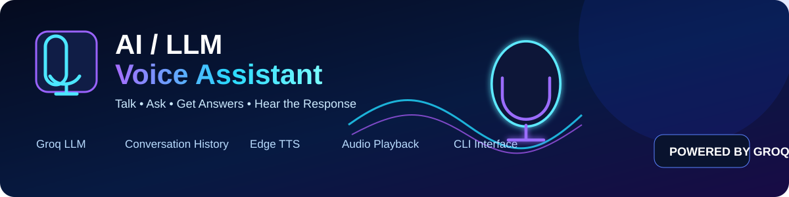

# AI / LLM Voice Assistant

<p align="center">
  
</p>

A lightweight command-line voice assistant powered by a Groq-hosted LLM, with conversation history and text-to-speech output.

## Features

- Groq LLM integration
- Conversational context and message history
- Configurable model through environment variables
- Text-to-Speech with Edge TTS
- MP3 playback with Pygame
- Colorized CLI interface
- Basic error handling
- No API keys hard-coded in source code

## Architecture

```text
User Input
    |
    v
Groq LLM
    |
    v
Assistant Response
    |
    +----> Conversation History
    |
    v
Edge TTS
    |
    v
Audio Playback
```

## Requirements

- Python 3.10+
- A Groq API key
- Internet connection for LLM inference and Edge TTS

## Installation

```bash
git clone https://github.com/moeinnrz/AI-LLM-Voice-Assistant.git
cd AI-LLM-Voice-Assistant

python -m venv .venv
# Windows
.venv\\Scripts\\activate
# Linux/macOS
source .venv/bin/activate

pip install -r requirements.txt
```

Create a `.env` file from `.env.example`:

```env
GROQ_API_KEY=your_api_key_here
GROQ_MODEL=openai/gpt-oss-20b
TTS_VOICE=en-US-AriaNeural
```

Run:

```bash
python main.py
```

## Security

Never commit `.env` or real API keys. Use `.env.example` as the public configuration template.

## License

This project is provided for educational and portfolio purposes.
